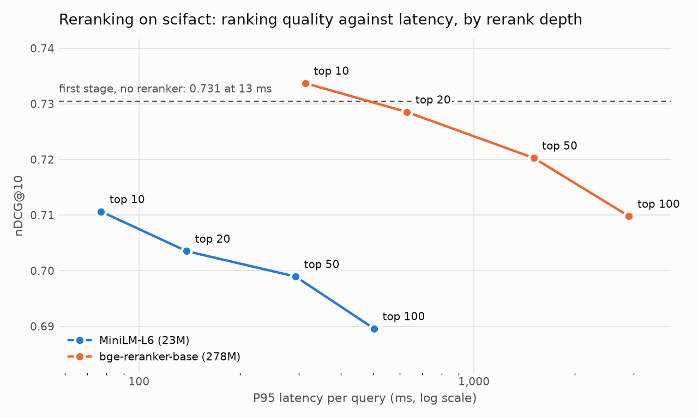

# Hybrid Retrieval Engine

A search engine built in stages (BM25, dense retrieval, fusion, reranking, pruning) with an evaluation harness that measures what each stage adds in ranking quality and what it costs in latency.

The common advice is "add hybrid search and a reranker". This project tests each part of that advice and reports where it holds:

- **Dense retrieval is better than BM25** on both datasets, by 0.05 and 0.17 nDCG@10.
- **Rank fusion (RRF) is not better than dense alone.** It is equal on one dataset and significantly worse on the other.
- **Weighted fusion with a tuned weight is better than dense**, on both datasets, by a small margin (0.02 and 0.01).
- **Neither cross-encoder reranker is worth its cost** on the dataset where it was tested: 28 to 240 times the latency for no significant gain.
- **MaxScore pruning returns the same BM25 results 2.5 to 9.6 times faster** (P50, top 10), and the gain grows with corpus size.
- **Approximate search (HNSW) is not worth it at 57,000 documents.** It makes the vector search 4.5 times faster and the whole query 13% faster, because the query encoder dominates.



*Reranking on SciFact. Each point is one rerank depth. The dashed line is the first stage with no reranker. Details are in [Reranking](#reranking).*

Every number below comes from a script in [`benchmarks/`](benchmarks), and the raw output is in [`benchmarks/results/`](benchmarks/results).

## Quick start

Reproduce the first number in the tables below (BM25 on SciFact, 0.660 nDCG@10) in about a minute. It needs no model and no GPU, and it downloads one small dataset.

```bash
git clone https://github.com/yash-bitla/hybrid-retrieval-engine.git && cd hybrid-retrieval-engine
python3.12 -m venv .venv && source .venv/bin/activate && pip install -e .
```

```python
from pathlib import Path

from hybrid_retrieval import BM25Index
from hybrid_retrieval.beir import download, load
from hybrid_retrieval.evaluate import evaluate, to_markdown

dataset = load(download("scifact", Path("data")))
index = BM25Index(list(dataset.corpus), list(dataset.corpus.values()))
print(to_markdown([evaluate(index, dataset, name="bm25")]))
```

The commands for every other table are in [Reproduce](#reproduce).

## Datasets

Two [BEIR](https://github.com/beir-cellar/beir) datasets for quality, and a third for corpus-size scaling.

| Dataset | Content | Documents | Test queries | Used for |
|---|---|---:|---:|---|
| SciFact | Scientific claims against paper abstracts | 5,183 | 300 | Quality, reranking, pruning |
| FiQA | Finance questions against forum answers | 57,638 | 648 | Quality, pruning, approximate search |
| Quora | Duplicate questions | 522,931 | 1,000 (of 10,000) | Pruning only |

## First-stage retrieval

Brackets are 95% bootstrap confidence intervals over queries (10,000 resamples). Latency is per query, single thread, on an Apple Silicon laptop. The dense model is `BAAI/bge-small-en-v1.5`.

**SciFact**

| Retriever | nDCG@10 | MRR@10 | Recall@100 | P50 ms | P95 ms |
|---|---|---|---|---:|---:|
| bm25 | 0.660 [0.615, 0.705] | 0.627 [0.578, 0.675] | 0.886 [0.848, 0.920] | 0.16 | 0.30 |
| dense | 0.713 [0.669, 0.756] | 0.682 [0.634, 0.729] | 0.942 [0.913, 0.967] | 6.94 | 12.76 |
| hybrid, RRF | 0.703 [0.660, 0.747] | 0.672 [0.625, 0.718] | 0.965 [0.943, 0.983] | 8.43 | 14.93 |
| hybrid, weighted (alpha = 0.7) | 0.731 [0.688, 0.771] | 0.698 [0.652, 0.744] | 0.968 [0.948, 0.987] | 7.14 | 8.51 |

**FiQA**

| Retriever | nDCG@10 | MRR@10 | Recall@100 | P50 ms | P95 ms |
|---|---|---|---|---:|---:|
| bm25 | 0.236 [0.214, 0.259] | 0.294 [0.264, 0.324] | 0.509 [0.478, 0.539] | 0.98 | 1.54 |
| dense | 0.403 [0.375, 0.432] | 0.488 [0.454, 0.522] | 0.696 [0.668, 0.724] | 8.59 | 9.12 |
| hybrid, RRF | 0.349 [0.323, 0.375] | 0.421 [0.389, 0.454] | 0.685 [0.656, 0.713] | 9.81 | 10.73 |
| hybrid, weighted (alpha = 0.8) | 0.412 [0.384, 0.441] | 0.491 [0.458, 0.525] | 0.696 [0.668, 0.724] | 9.72 | 10.71 |

The intervals in those tables overlap, so they cannot say which retriever is better. Both systems answer the same queries, so the right test is on the per-query difference (paired bootstrap). A difference is significant when its interval excludes 0.

| Candidate | Baseline | SciFact nDCG@10 difference | FiQA nDCG@10 difference |
|---|---|---|---|
| dense | bm25 | +0.052 [+0.016, +0.089] | +0.168 [+0.143, +0.192] |
| hybrid, RRF | dense | -0.009 [-0.036, +0.017] (not significant) | -0.054 [-0.073, -0.036] |
| hybrid, weighted | dense | +0.018 [+0.004, +0.032] | +0.009 [+0.002, +0.015] |
| hybrid, weighted | hybrid, RRF | +0.027 [+0.007, +0.048] | +0.063 [+0.047, +0.079] |

**What the numbers say.**

- **Hybrid is not automatically better.** RRF gives each retriever an equal vote. When one retriever is much weaker, that vote pulls good results down. On FiQA, BM25 is 0.168 behind dense, and RRF loses 0.054 against dense alone.
- **A tuned weight fixes that, for a small gain.** The best weight puts 70% (SciFact) and 80% (FiQA) on dense. The gain over dense is significant on both datasets, and it is 0.018 and 0.009.
- **On SciFact, fusion helps recall more than ranking.** Recall@100 goes from 0.942 to 0.968. On FiQA it does not move.
- **The cost of dense and hybrid is the query encoder.** BM25 answers in under 1 ms. Each dense or hybrid query takes 7 to 10 ms, and about 6.5 ms of that is the embedding model.

**The fusion weight is tuned without the test set.** Alpha was chosen from 11 values on each dataset's training queries (809 for SciFact, 5,500 for FiQA). The test queries were used once, for the tables above.

**Checks against published numbers.** The BEIR paper reports 0.665 (SciFact) and 0.236 (FiQA) nDCG@10 for BM25. The BGE model card reports 0.713 and 0.403 for `bge-small-en-v1.5`. This harness gets 0.660, 0.236, 0.713 and 0.403.

## Reranking

A cross-encoder rescores the top candidates of the best first stage (the weighted hybrid). Two models, four rerank depths, the 300 SciFact queries. The gain column is a paired bootstrap against the first stage. The chart at the top of this page plots this table.

| Reranker | Depth | nDCG@10 | Gain over first stage | Significant | P50 ms | P95 ms |
|---|---:|---|---|---|---:|---:|
| none (first stage) | 0 | 0.731 [0.688, 0.771] | | | 11.1 | 12.5 |
| `ms-marco-MiniLM-L-6-v2` (23M) | 10 | 0.711 [0.668, 0.752] | -0.020 [-0.042, +0.002] | no | 62.2 | 77.1 |
| | 20 | 0.704 [0.660, 0.745] | -0.027 [-0.053, -0.001] | yes | 130.4 | 138.6 |
| | 50 | 0.699 [0.656, 0.742] | -0.032 [-0.060, -0.004] | yes | 260.6 | 293.4 |
| | 100 | 0.690 [0.646, 0.733] | -0.041 [-0.070, -0.013] | yes | 442.8 | 503.0 |
| `bge-reranker-base` (278M) | 10 | 0.734 [0.692, 0.774] | +0.003 [-0.018, +0.023] | no | 312.1 | 313.7 |
| | 20 | 0.729 [0.687, 0.768] | -0.002 [-0.026, +0.021] | no | 610.4 | 630.7 |
| | 50 | 0.720 [0.678, 0.760] | -0.010 [-0.036, +0.015] | no | 1368.0 | 1506.6 |
| | 100 | 0.710 [0.667, 0.751] | -0.021 [-0.049, +0.006] | no | 2634.9 | 2900.9 |

- **Neither reranker is worth its cost on this dataset.** The small model makes the ranking worse, and three of its four losses are significant. The large model never differs significantly from the first stage, and its best point (+0.003 at depth 10) costs 312 ms against 11 ms.
- **A deeper rerank is worse, for both models.** The first stage has 96.8% of the relevant documents in its top 100, so better documents are there to be promoted. The rerankers promote the wrong ones.
- **Latency grows linearly with depth.** A cross-encoder runs one forward pass per candidate and can precompute nothing.
- **A likely cause is domain mismatch, and it is not tested here.** Both rerankers are general-purpose models, and SciFact queries are scientific claims. Reranking was not run on FiQA, so this result is for one dataset.

Reranker latency was measured on the laptop GPU (Apple MPS).

## Speed

### BM25: MaxScore pruning

A plain BM25 search reads every posting of every query term. MaxScore keeps the largest score that each term can add to any document. When a common word such as "the" cannot lift a document into the current top k by itself, the search stops walking that word's list and only looks documents up in it. The top k is the same as the exhaustive search's: it matched on 100% of the queries of all three datasets.

Top 10, single thread. "Postings read" is the share of the query terms' postings that the search touched.

| Dataset | Documents | Method | Mean ms | P50 ms | P95 ms | Postings read |
|---|---:|---|---:|---:|---:|---:|
| SciFact | 5,183 | NumPy, term-at-a-time | 0.10 | 0.10 | 0.15 | 100% |
| | | compiled, document-at-a-time | 0.15 | 0.13 | 0.27 | 100% |
| | | compiled + MaxScore | 0.05 | 0.04 | 0.13 | 9% |
| FiQA | 57,638 | NumPy, term-at-a-time | 0.75 | 0.76 | 1.12 | 100% |
| | | compiled, document-at-a-time | 1.48 | 1.42 | 2.89 | 100% |
| | | compiled + MaxScore | 0.34 | 0.26 | 0.89 | 7% |
| Quora | 522,931 | NumPy, term-at-a-time | 4.32 | 4.30 | 6.23 | 100% |
| | | compiled, document-at-a-time | 7.32 | 6.61 | 14.95 | 100% |
| | | compiled + MaxScore | 0.82 | 0.45 | 2.65 | 5% |

- **The gain grows with the corpus.** P50 speedup over the NumPy search: 0.10 / 0.04 = 2.5 times at 5,000 documents, 0.76 / 0.26 = 2.9 times at 57,000, and 4.30 / 0.45 = 9.6 times at 523,000.
- **The gain comes from the algorithm, not from compiling.** The middle row is the same compiled loop with pruning off, and it is slower than NumPy. Walking lists one document at a time has overhead that only pays off when most documents are skipped.
- **The tail gains less than the median.** On Quora, P95 improves 6.23 / 2.65 = 2.4 times against 9.6 times at P50. Queries with no dominant rare term prune badly.
- **A larger k prunes less.** For the top 100 on Quora, MaxScore reads 11% of the postings and P50 is 1.46 ms (3.0 times faster). The threshold for entry into the top 100 is lower, so fewer documents can be ruled out.

### Dense: exact search against HNSW

FiQA, 57,638 vectors of 384 dimensions, top 10, single thread. Recall@10 is the overlap with the exact search's top 10.

| Index | M | efSearch | Recall@10 against exact | nDCG@10 | P50 ms | P95 ms | Build s | Size MB |
|---|---:|---:|---:|---:|---:|---:|---:|---:|
| exact | | | 1.000 | 0.403 | 1.333 | 1.444 | 0.0 | 89 |
| HNSW | 16 | 16 | 0.831 | 0.366 | 0.048 | 0.069 | 16.6 | 97 |
| HNSW | 16 | 64 | 0.963 | 0.396 | 0.137 | 0.178 | 16.6 | 97 |
| HNSW | 32 | 32 | 0.940 | 0.393 | 0.095 | 0.130 | 19.1 | 104 |
| HNSW | 32 | 128 | 0.990 | 0.400 | 0.294 | 0.388 | 19.1 | 104 |
| HNSW | 32 | 256 | 0.996 | 0.402 | 0.527 | 0.702 | 19.1 | 104 |

The full sweep (two values of M, six of efSearch) is in [`fiqa-ann.md`](benchmarks/results/fiqa-ann.md).

- **HNSW works as advertised.** At M = 32 and efSearch = 128 it finds 99.0% of the exact neighbors, loses 0.003 nDCG@10, and is 1.333 / 0.294 = 4.5 times faster.
- **It does not matter at this size.** Encoding the query takes 6.46 ms. A full dense query is 6.46 + 1.33 = 7.79 ms with exact search and 6.46 + 0.29 = 6.75 ms with HNSW: 13% faster, for a 19-second build, 17% more memory and a recall loss.
- **The break-even is near 280,000 documents.** Exact search is one pass over all vectors, so its cost grows linearly: 1.333 ms for 57,638 documents. It equals the 6.46 ms encoder cost at 57,638 × 6.46 / 1.333 = about 279,000 documents. Below that, the encoder is the thing to optimize. This is an extrapolation and was not measured.

## How it works

- **`BM25Index`** is an inverted index stored as three flat arrays (posting offsets, document indexes, impacts). The BM25 formula is fully evaluated at build time, so a query only adds stored impacts. The tests check every score against a brute-force implementation of the formula.
- **`daat_topk`** is the document-at-a-time search with MaxScore, compiled with Numba. The tests check that it returns the exhaustive top k for 50 random queries at k = 1, 10 and 100.
- **`DenseIndex`** is exact cosine search: one matrix-vector product over all document embeddings. **`HnswIndex`** is the approximate version, a thin wrapper over FAISS.
- **`rrf`** and **`weighted`** fuse rankings. RRF uses ranks only. `weighted` rescales each retriever's scores to [0, 1] and takes a weighted sum.
- **`Reranker`** rescores the top `depth` candidates of any retriever with an injected scoring function. Candidates below `depth` keep their first-stage order.
- **`evaluate`** runs each query once at depth 100 and scores that ranking with nDCG@10, MRR@10 and Recall@100. Any object with a `search(query, k)` method can be evaluated.
- **`bootstrap_ci`** resamples queries with replacement and reports the percentile interval of the mean. **`paired_bootstrap`** does the same for the per-query difference between two retrievers.

Models are injected as plain functions, so the library imports no model code and the tests need no downloads.

```python
from hybrid_retrieval import BM25Index

index = BM25Index(["d1", "d2"], ["the cat sat on the mat", "the dog chased the cat"])
index.search("cat", k=10)                      # [("d2", ...), ("d1", ...)]
index.search("cat", k=10, method="maxscore")   # the same result, with pruning
```

## Limits

- Two quality datasets and one dense model. Reranking was measured on SciFact only.
- All latency is from one laptop, single thread. Absolute numbers do not transfer to a server. Ratios and growth rates are the claims.
- The tokenizer has no stemming and no stopword removal.
- The significance tests are not corrected for multiple comparisons.
- The index is built in memory and is not persisted.

## Reproduce

```bash
python3.12 -m venv .venv && source .venv/bin/activate
pip install -e ".[dev,dense,ann,bench]"

python -m benchmarks.run --dataset scifact      # first-stage tables
python -m benchmarks.run --dataset fiqa         # about 5 minutes to embed the corpus
python -m benchmarks.rerank --dataset scifact   # about 35 minutes on a laptop GPU
python -m benchmarks.plot --dataset scifact
python -m benchmarks.pruning --datasets scifact fiqa quora
python -m benchmarks.ann --dataset fiqa
```

## Development

```bash
pip install -e ".[dev]"
pytest && ruff check . && mypy
```

## License

[MIT](LICENSE)
